# TSDMS

Textbook Subscription and Distribution Manager System.


# How to import

If you want to import this project, you should modify some cofigurarion information first.

**1. Import SQL File**

Enter your MySQL, then create a database name `tsdms`

```mysql
mysql> CREATE DATABASE tsdms;
```

Then use it
```mysql
mysql> USE tsdms;
```

Now you can input the below code to import `tsdms.sql` file, and the `<project path>` is the current path to this project.
```mysql
mysql> source <project path>/tsdms.sql;
```

**2. Change Configure File**

Under the `<project path>/src/main/java` floder, there is a file called `mysql.ini`, which contains the configuration information of your MySQL , including the account and password, you should change it to your own.

Then open the `JDBCUtils.java` under the `<project path>/src/main/java/utils`, set your `mysql.ini` location path to param `INIT_FILE`

For example, my code is as follows:

```java
private final static String INIT_FILE = "F:/IDEA Project/TSDMS/src/main/java/mysql.ini";
```

you should change it to your own


**3. Import this project**

After the above steps have been completed, you can use IntelliJ IDEA to import the project.


# Screenshot

## Common

 + Login
 + Register

<br />
<br />
<div align="center" >
	
	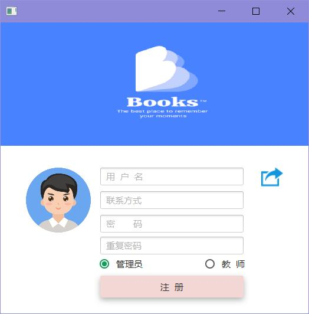
</div>
<br />
<br />

## Administrator

 + Textbook information manager
 + Add textbook
 + Add press information
 + Subscription information search
 + Distribution information search
 + Distribute textbook
 + Administrator information manager

<br />
<br />
<div align="center">
	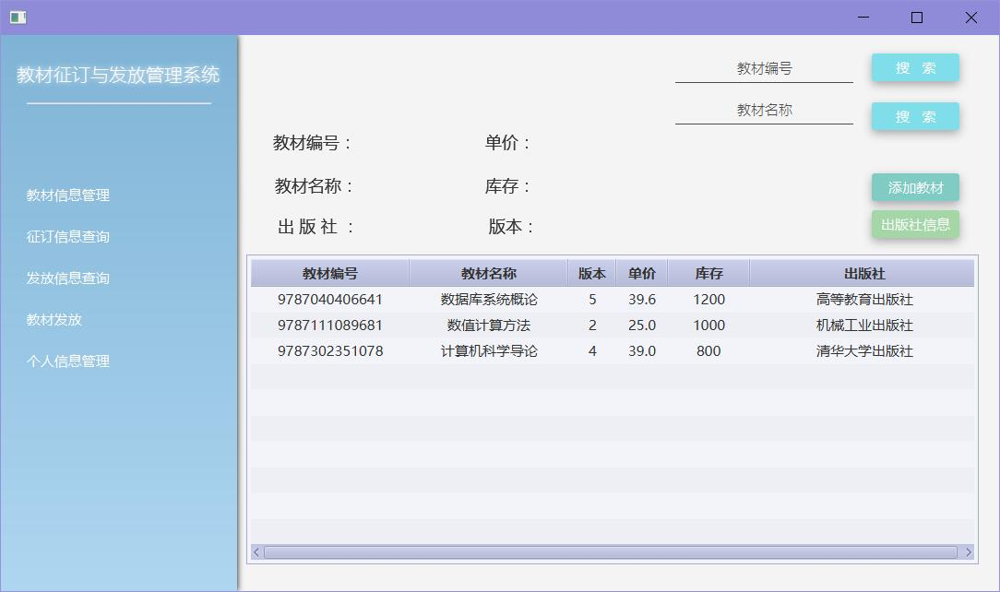
	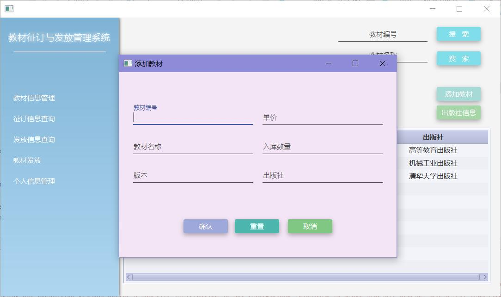
	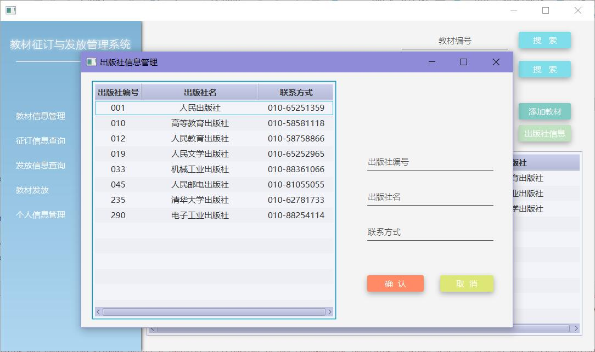
	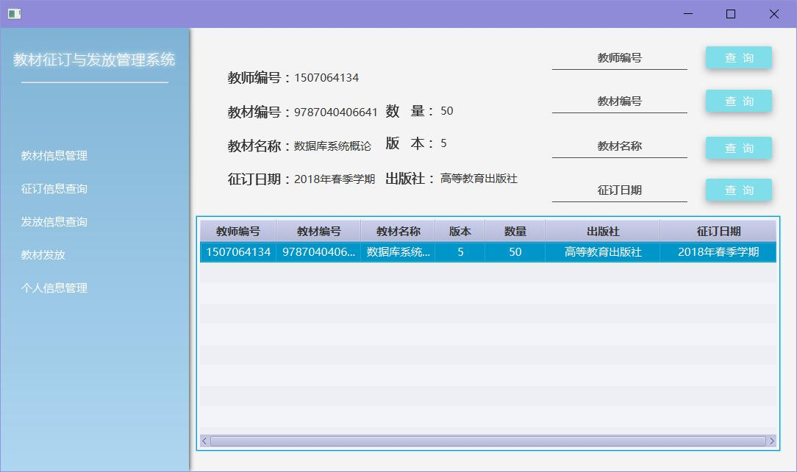
	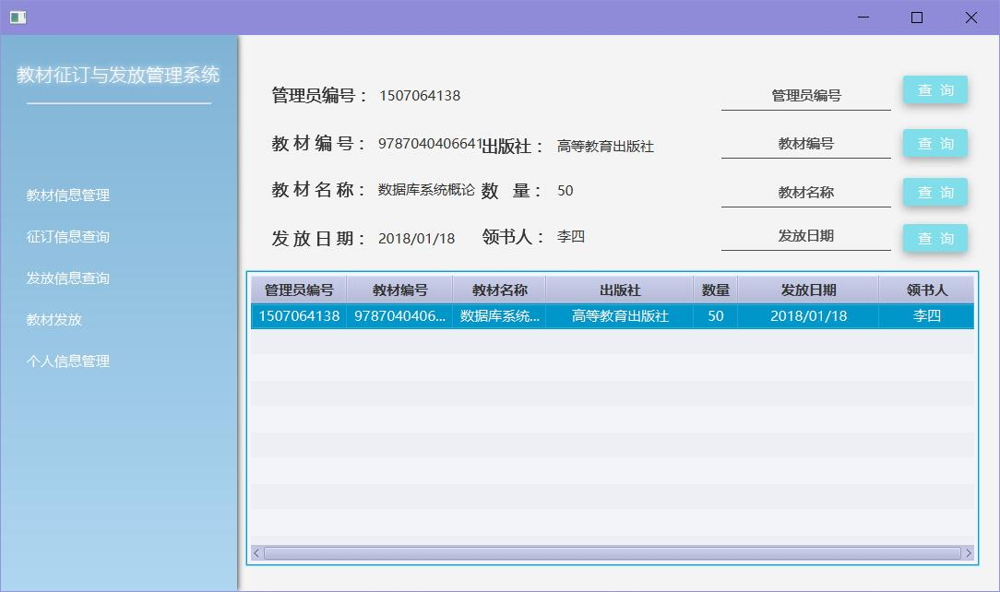
	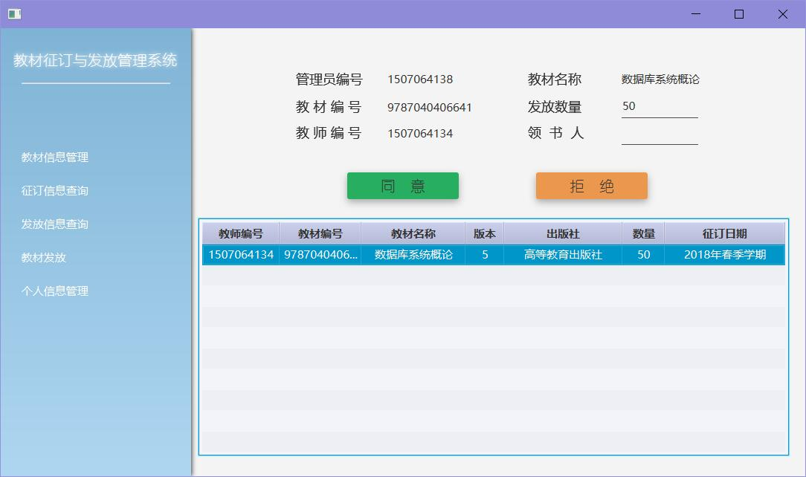
	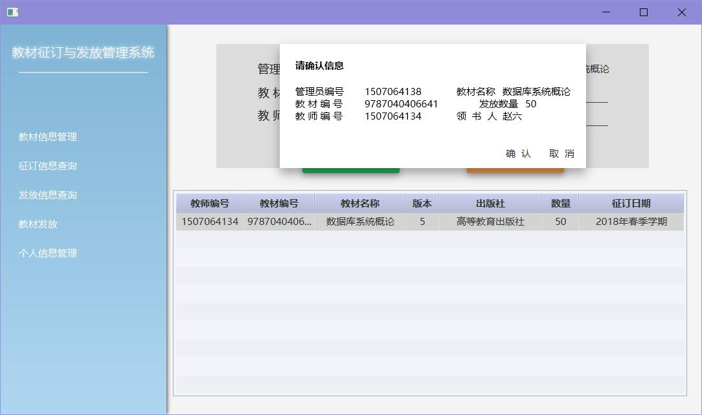
	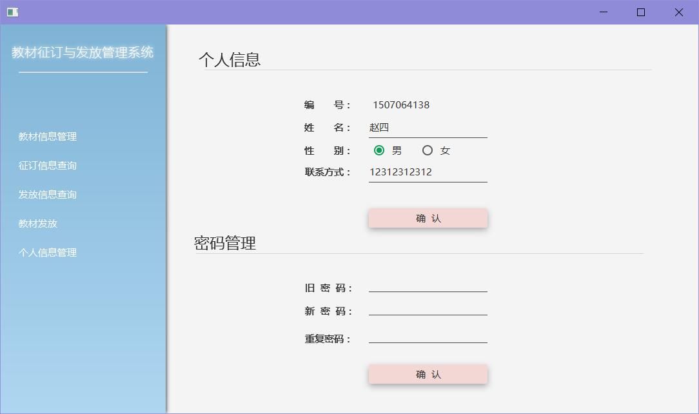
</div> 

<br />
<br />

## Teacher

 + Textbook infomation manager
 + Subscribe textbook
 + Class information manager
 + Teacher information manager

<br />
<br />
<div align="center">
	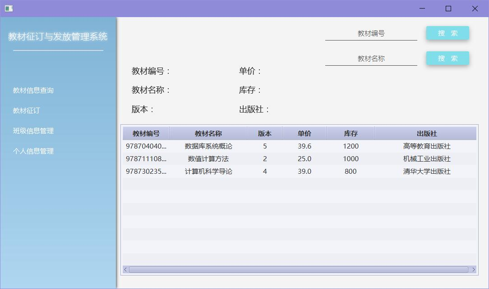
	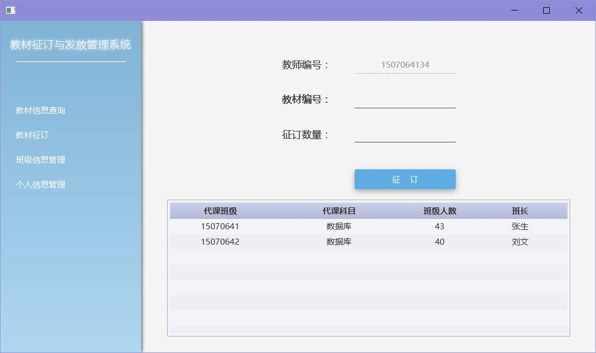
	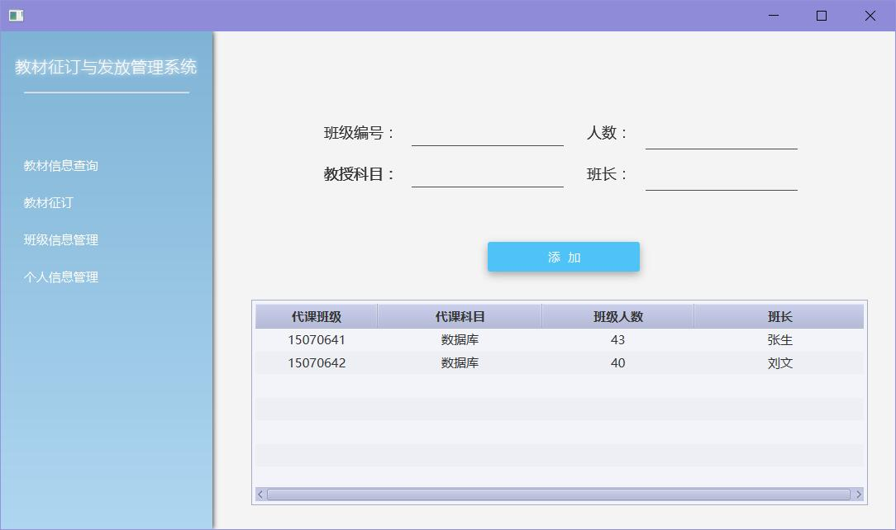
	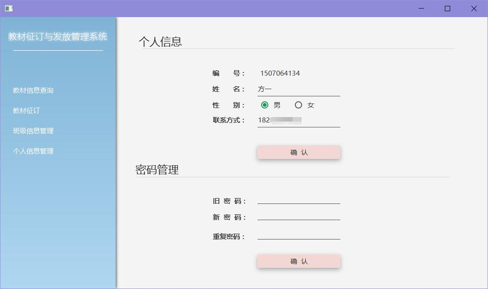
</div> 

<br />
<br />
<br />

# [License](https://github.com/InnoFang/TSDMS/blob/master/LICENSE)


			Copyright 2017 InnoFang

			Licensed under the Apache License, Version 2.0 (the "License");
			you may not use this file except in compliance with the License.
			You may obtain a copy of the License at

			   http://www.apache.org/licenses/LICENSE-2.0

			Unless required by applicable law or agreed to in writing, software
			distributed under the License is distributed on an "AS IS" BASIS,
			WITHOUT WARRANTIES OR CONDITIONS OF ANY KIND, either express or implied.
			See the License for the specific language governing permissions and
			limitations under the License.